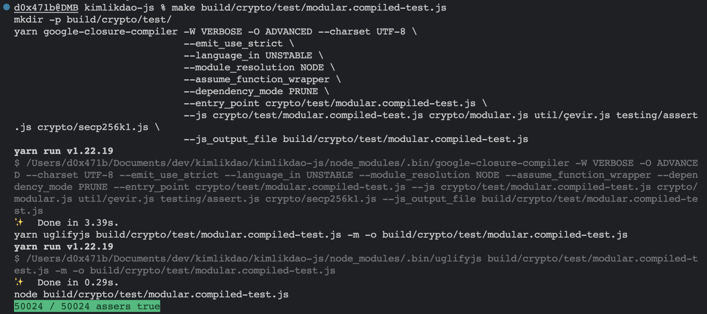
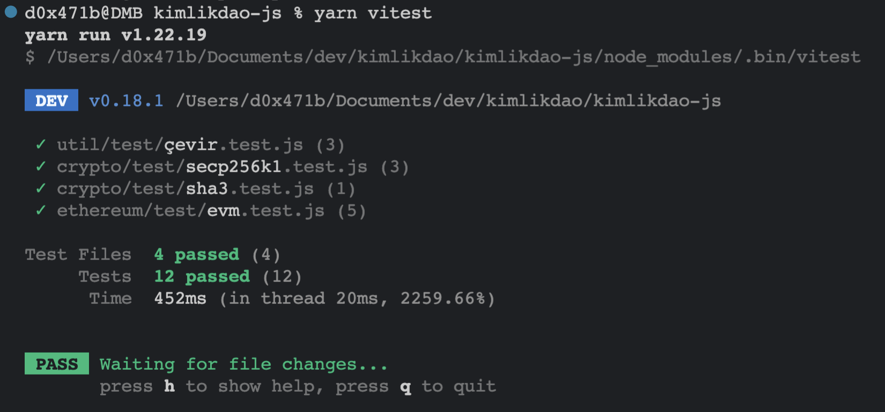

# Nedir?
kimlikdao-js, KimlikDAO projeleri için gerekli olan javascript modüllerinin tutulduğu repodur.

# Nasıl klonlanır?

```shell 
git clone https://github.com/KimlikDAO/kimlikdao-js
yarn
``` 
komutları ile repoyu yerel geliştirme ortamına klonladıktan sonra reponun çalışması için gerekli olan paketler indirilmelidir.

# Testleri

Bu repoda iki tür test çeşidi vardır. Bunlar aşağıdaki gibidir:
* ```compiled-test```: Makefile üzerinden GCC (Google Closure Compiler) kullanarak çalıştırılan testlerdir. 
* ```vitest```: Vite tarafından geliştirilen Vitest framework'ü kullanılarak yazılan testlerdir.

### compiled-test'ler nasıl çalıştırılır?

Örnek olarak ```crypto/test/modular.compiled-test.js```'i çalıştırmak için ```make build/crypto/test/modular.compiled-test.js``` komutunu çalıştırmak gerekir. Sorunsuz çalıştırılması durumunda aşağıdaki gibi bir çıktı oluşur:\
 

### vitest'ler nasıl çalıştırılır?

Vitest'leri çalıştırmak için ```yarn vitest``` komutunu çalıştırmak yeterli olacaktır. Sorunsuz çalıştırılması durumunda aşağıdaki gibi bir çıktı oluşur:\
 
 
# Dizin yapısı

```api```: e-Devlet API tanımları\
```crypto```: Kriptografik fonksiyonlar ve kütüphaneler\
```ethereum```: Ethereum node'ları ile etkileşim araçları\
```tckt```: KimlikDAO'nun TCKT veri tanımları\
```testing```: Test yazma kütüphaneleri\
```util```: Çevirme araçları ve extern tanımları\
```ipfs.js```: Basit IPFS istemcisi

# Yeni modüller

Yeni bir modül eklenmesi durumunda eğer modül [kimlikdao-js dizin yapısı](#kimlikdao-js-dizin-yapısı) kısmında bahsedilen dizin içeriklerden birisine uygun ise o dizinin içine koyulabilir; değil ise, yeni bir dizin oluşturulmalı ve modül yeni dizine eklenmelidir. Yeni oluşturulan dizinde, yazılacak testler için ```test``` klasörü oluşturulmalıdır.
