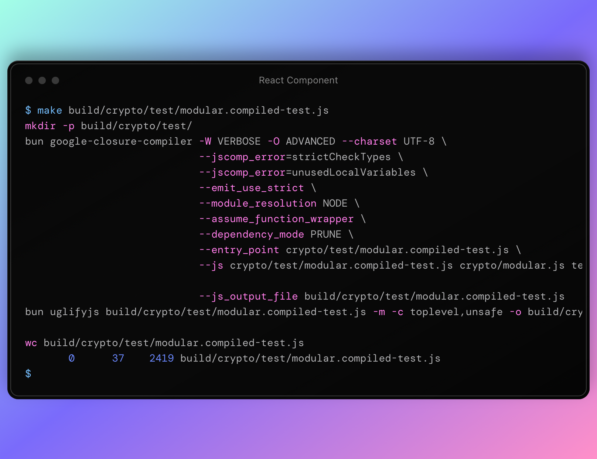

# Nedir?
kimlikdao-js, KimlikDAO projeleri için gerekli olan javascript modüllerinin tutulduğu repodur.

# Dizin yapısı

`api`: Standart protokol tanımları (örneğin: jsonrpc, oauth2)

`birimler`: Birim sistemi ile ilgili araçlar ve tanımlar

`cloudflare`: Cloudflare Workers platformu ile ilgili tanımlar

`crosschain`: Tüm blokzincirlerde geçerli tanımlar ve yapılar

`crypto`: Kriptografik fonksiyonlar ve kitaplıklar

`did`: KimlikDAO'nun DID ve TCKT tanımları

`ethereum`: Ethereum node'ları ile etkileşim araçları

`node`: KimlikDAO protocol node'larıyla konuşurken gerekli tanımlar

`testing`: Test yazma kütüphaneleri

`util`: Çevirme araçları ve extern tanımları

# Nasıl klonlanır?

```shell 
git clone https://github.com/KimlikDAO/kimlikdao-js
cd kimlikdao-js
bun i
``` 
komutları ile repoyu yerel geliştirme ortamına klonlanıp sonra reponun çalışması için gerekli olan paketler indirilir.

# Testler

Bu repoda iki tür test var:
* `compiled-test`: Makefile kullanarak GCC (Google Closure Compiler) ile derlenip bun veya tarayıcı ortamında çalıştırılan testler.
* `bun test`: Bun test koşucusu ile bun ortamında çalıştırılan testler.

### compiled-test'ler nasıl çalıştırılır?

Örnek olarak `crypto/test/modular.compiled-test.js`'i çalıştırmak için `make build/crypto/test/modular.compiled-test.js` komutunu çalıştırmak gerekir. Sorunsuz çalıştırılması durumunda aşağıdaki gibi bir çıktı oluşur:



### Bun testler nasıl çalıştırılır?

Bun testleri çalıştırmak için `bun test` komutunu çalıştırmak yeterli olacaktır. Sorunsuz çalıştırılması durumunda aşağıdaki gibi bir çıktı oluşur:

# Yeni modüller

Yeni bir modül eklenmesi durumunda eğer modül [dizin yapısı](#Dizin-yapısı) kısmında bahsedilen dizin içeriklerden birisine uygun ise o dizinin içine koyulabilir; değil ise, yeni bir dizin oluşturulmalı ve modül yeni dizine eklenmelidir.
